# Análisis del sector de telecomunicaciones(Internet)

El objetivo de este análisis es proporcionar el panorama a nivel global sobre el acceso a internet ya que simulamos la entrada de una empresa que quiere entrar al mercado Nacional de Argentina por lo cuál debemos de proporcionar la información necesaria para que la empresa tome decisiones de entrar al mercado.

# Fuente de datos
Los datos con los cuales se hace el análisis son proporcionados por 
- [ENACOM](https://indicadores.enacom.gob.ar/datos-abiertos) 
- [población de argentina](https://populationtoday.com/ar-argentina/)
- [Proveedores de servicios de Internet](dhttps://www.argentina.gob.ar/sites/default/files/isp_por_provincias_2.pdf)
 

# Desarrollo 
Para este análisis realicé ETL´s para obtener los datos por hoja del archivo de excel llamado Intenet, asi como otros archivos los cuales son:

- mapa_conectividad.xlsx
- Portabilidad.xlsx
- isp_por_provincias_2.pdf

Una vez que obtuve los datos y verifique el tipo de dato, campos nulos y que no hubiera registros duplicados realicé un análisis exploratorio de los datos para entrar en contexto y poder hacer una conexión a la base de datos MySQL para subir los datos.

El archivo ETL.ipynb está en la carpeta src

Ya una vez con la base de datos desarrollé un dashboard para representar un story telling al cuál llegué por medio del EDA.

# EDA
Hay 3 archivos de EDA que conforme fui avanzando el mi análisis fui explorando más opciones y parte de ese análisis lo muestro en imagenes con descripciones de lo que fui encontrando en los datos.

Inicié mi análisis exploratorio checando las variables númericas y variables categóricas

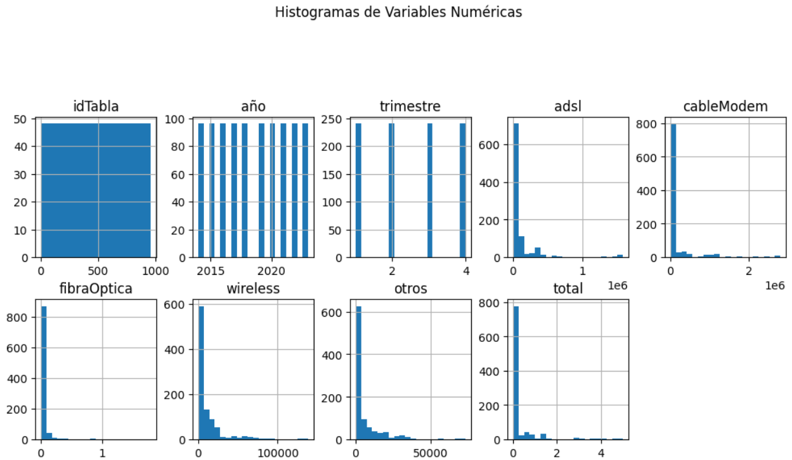

Continué con la variable Categórica

Busqué outlayers
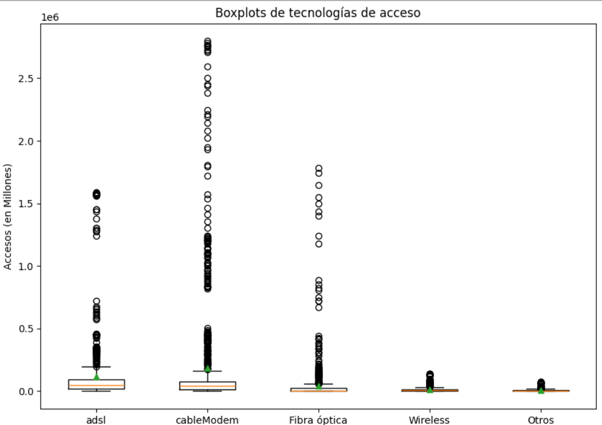

hice algunos hallazgos...
# Hallazgos
La tendencia por acceso tecnológico es Cable-modem y fibra Óptica 

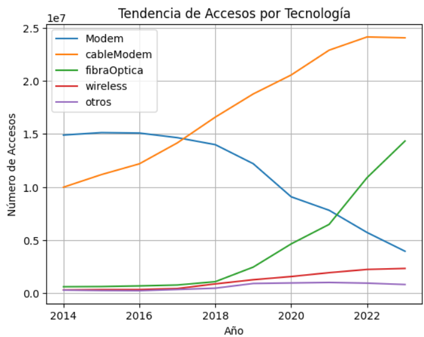

Sin embargo cuando analice por provincia hay un caso que llama mi atención y es la provincia de San Luis en la que predomina la conexión por wireless y al parecer el gobierno provincial de San Luis ha invertido en infraestructura WiFi con el plan San Luis A1000, de acuerdo 
al siguiente: [artículo](https://agenciasanluis.com/2022/08/31/815248-san-luis-es-la-provincia-mas-digital-del-pais/)

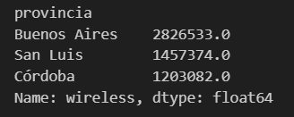

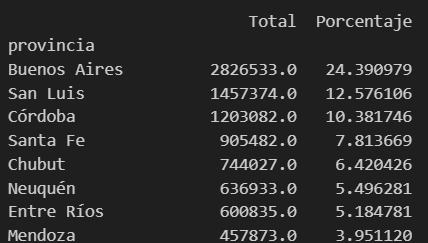

Por lo que San Luis aparece en segundo lugar a nivel de uso de tecnología wireless con un 12% de accesos

Conexiones por provincia anualizadas

# Dashboard en Power BI

La fuente de datos de power BI es una base de datos hecha en mySQL

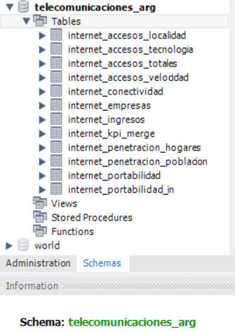

Mediante la herramienta de Power BI realicé un dashboard para Generar un history telling en el cual podemos ver que hay muchas empresas proveedoras del servicio de internet, inicialmente vemos que las empresas son: claro y movistar las que están en el archivo de portabilidad, y al ver los datos notamos que va disminuyendo los clientes asi que nos dimos a la tarea de buscar mayor información y encontramos en datos del gobierno argentino que son 436 empresas registradas como proveedores de servicios de internet ubicadas por provincia.

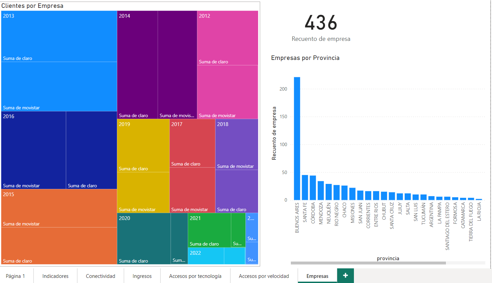

En 2014 la velocidad predominante era 1-6 Mbps con el 80% de conexiones y en 2023 la velocidad predominante es más de 30 Mbps con el 68%.

Las 3 provincias que más conexiones tienen son: Buenos Aires, Capital Federal y Córdoba

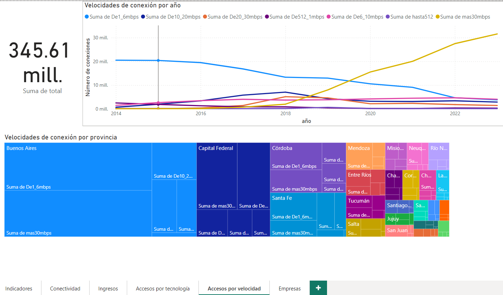

En San Luis y Formosa wireless esta ganando terreno San Luis esta en segundo lugar y Formosa en el lugar 10 a nivel de tecnologia wireless

Podemos ver el top 10 de provincias de acuerdo a la tecnología que más han venido utilizando 

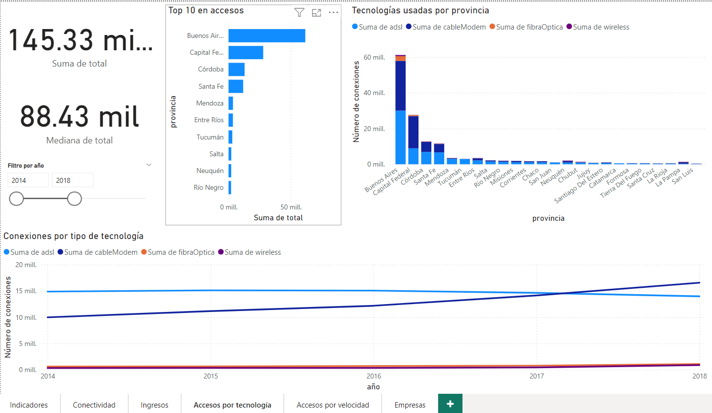

En 2023 los ingresos por accesos a internet han crecido un 64% conrespecto al año anterior, 2022 creció por arriba del 40% asi como 2021.

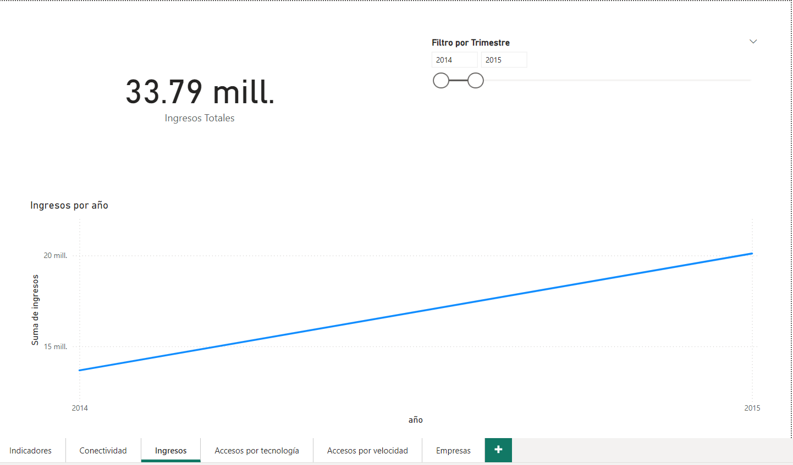

En la parte norte del País de Argentina se nota mayor conectividadindependientemente de la tecnología usada.
Buenos Aires tiene casi el 50% de la población de Argentina
Tierra del Fuego ocupa el último lugar en población con apenas el 0.34% de población distribuida en la provincia

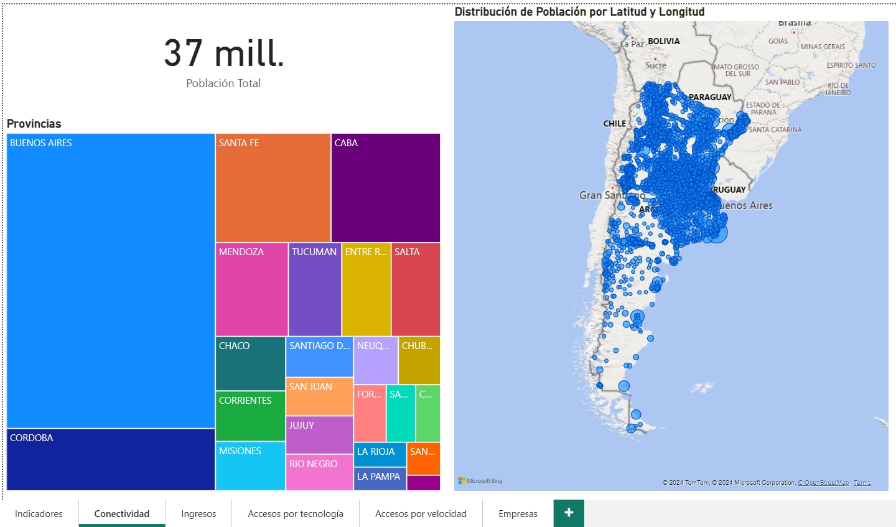

y por último nos proponemos objetivos en un idicador de rendimiento de Aumentar en un 2% el acceso a Internet por cada 100 hogares y observamos que en todas las provincias se llega al objetivo.

Tenemos otro KPI que tiene el objetivo de aumentar el acceso a internet independientemente de la tecnologia y vemos que en las provincias estuvieron muy cerca de alcanzar el objetivo.

Propusimos un tercer KPI con el objetivo de aumentar en un 2% el acceso a internet con la velocidad del mas de 30 Mbps ya que observamos que es la velocidad que más esta creciendo.

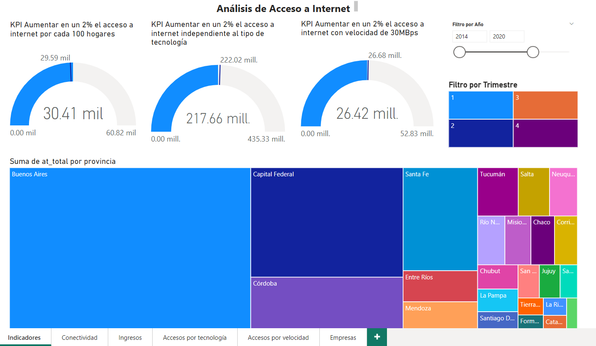

# Recomendaciones y conclusiones

- La velocidad a tomar en cuenta para proporcionar el servicio de Internet podria ser de más 30 Mbps para que la población se sienta atraída 

- El tipo de tecnología que ha venido a la alza es cableModem , fibra óptica 

- La tecnología wireless el gobierno de la provincia de San Luis es quien esta invirtiendo.

- La tecnología ASDL ha venido disminuyendo a lo largo del tiempo.

- En la parte Norte del país existen mayor número de conexiones que en la parte Sur.

- Los Ingresos han venido creciendo en los últimos 3 años con más del 40 % con respecto al año anterior.

- De acuerdo a los datos se puede entrar a proporcionar el servicio a las provincias con mayor población ya que aún se tiene un margen de casi el 50% de mercado en la penetración por hogares.

